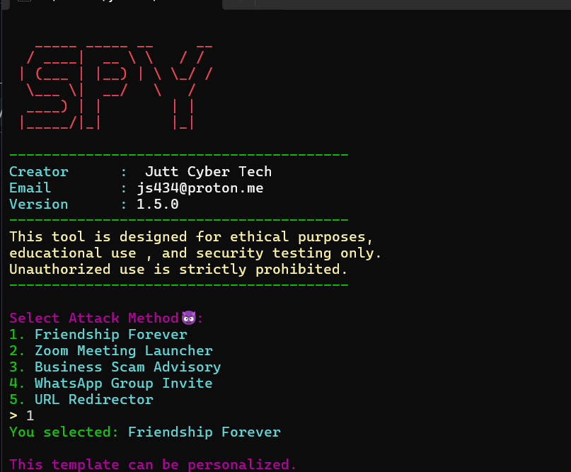

# 🔒 Spy

> A powerful, terminal-based phishing simulation & educational security tool.  
> **Use responsibly for learning and authorized testing only.**



---

## 🚀 Features

- 🌐 Launch a local phishing server with multiple templates  
- 📝 Customizable templates with personalizable fields  
- 📊 Real-time results in an admin panel  
- 🔐 Admin lockout notifications via email (optional)  
- ⚠️ Kill-switch and safe handling for educational testing

---

## 🛠 Installation

1. **Clone the repository:**
    ```bash
    git clone https://github.com/juttcybertech/Spy.git
    cd Spy
    ```

2. **Install dependencies:**  
   It's recommended to use a virtual environment.
    ```bash
    pip install -r requirements.txt
    ```

3. **Set up environment variables:**  
   Create a `.env` file in the root directory and add your admin credentials and email settings.
    ```
    ADMIN_USERNAME=your_admin_username
    ADMIN_PASSWORD=your_secure_password

    # Optional: For email notifications on admin lockout
    ADMIN_EMAIL=your_email@gmail.com
    EMAIL_PASSWORD=your_gmail_app_password
    ```

---

## ▶️ Usage

1. **Run the application:**
    ```bash
    python spy.py
    ```

2. **Select an attack vector:**  
   Follow the command-line prompts to choose a template. If the template is personalizable, enter the required details.

3. **Share the link:**  
   The server will provide a local network URL (e.g., `http://192.168.1.5:5050`). Share this only for authorized testing.

4. **View Results:**  
   Access the admin panel at `http://<your-ip>:5050/admin` and log in with your `.env` credentials to see collected data.

---

## ⚠️ Disclaimer

This tool is **strictly for educational purposes and authorized security testing**.  

**Illegal use is your responsibility.** Do not target individuals without explicit consent.  

Use safely and responsibly. 🛡️

---

## 📄 License

MIT License © [JuttCyberTech](https://github.com/juttcybertech)
